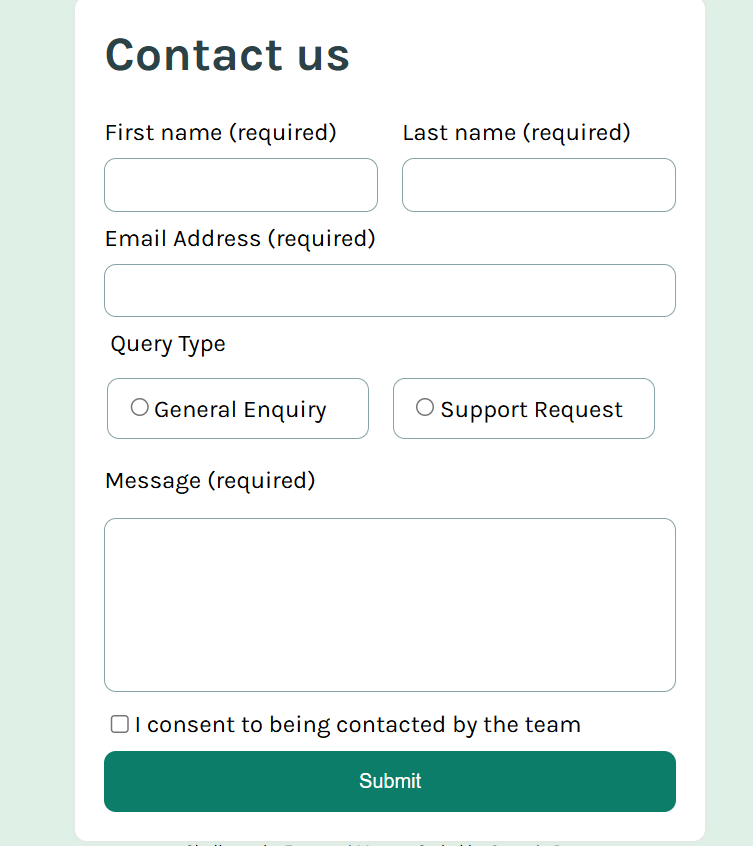
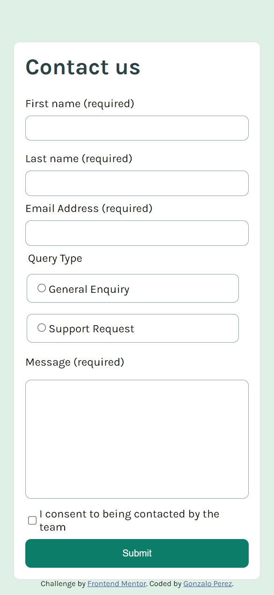

# Frontend Mentor - Contact form solution

This is my solution to the [Contact form challenge on Frontend Mentor](https://www.frontendmentor.io/challenges/contact-form--G-hYlqKJj).

## Table of contents

- [Overview](#overview)
  - [The challenge](#the-challenge)
  - [Screenshot](#screenshot)
  - [Links](#links)
- [My process](#my-process)
  - [Built with](#built-with)
  - [What I learned](#what-i-learned)
  - [Continued development](#continued-development)
  - [Useful resources](#useful-resources)
- [Author](#author)
- [Acknowledgments](#acknowledgments)

## Overview

### The challenge

Users should be able to:

- Complete the form and see a success toast message upon successful submission
- Receive form validation messages if:
  - A required field has been missed
  - The email address is not formatted correctly
- Complete the form only using their keyboard
- Have inputs, error messages, and the success message announced on their screen reader
- View the optimal layout for the interface depending on their device's screen size
- See hover and focus states for all interactive elements on the page

### Screenshot

Desktop design screenshot


Mobile design screenshot


### Links

- Live Site URL: [Click here](https://gonzagapa.github.io/Contact-form-frontend-mentor/)

## My process

### Built with

- Semantic HTML5 markup
- CSS custom properties
- Flexbox
- CSS Grid
- Mobile-first workflow
- CSS nesting
- Vanilla Javascript

### What I learned

Here are some great insights I got for this challenge:

1. Using _accent-color_ property to change the color
   of radio buttons and checkbox

```css
accent-color: var(--clr-primary);
/*Change the color of radio 
buttons and checkbox*/
```

With this small change all our checkboxes and radio button have the color that we wanted. It is an excellent way for styling without needed extensive customization.

2. Using relative colors to change a color base from another

```css
.inline {
  border: 1px solid var(--clr-bg-input);
  display: inline-block;
  padding: var(--padding-input);
  border-radius: var(--border-radius);

  /*Applying relative colors */
  &:has(input:checked) {
    background-color: hsl(from var(--clr-secondary) h s l / 0.6);
  }
}
```

One of my favorite recent features added into CSS. We can create complements colors base on existing one's.

In this example I used a custom property referencing a hsl color and then changing its alpha channel.

### Continued development

With this challenge, I sank into concepts like [CSS nesting](https://developer.mozilla.org/en-US/docs/Web/CSS/CSS_nesting), Flexbox, and Grid.

Besides, I had a head-first introduction to using transitions in CSS manipulating them dynamically with Javascript and making accesibility forms.

For future improvements, I would like to implement Typescript for the form validation code and polish up the confirm message animation.

### Useful resources

- [accent-color article by Michele Barker](https://www.smashingmagazine.com/2021/09/simplifying-form-styles-accent-color/) - In this amazing article I learnt how to use this property and has other incredible examples as well.
- [Using relative colors by MDN](https://www.example.com) - If you want to know more about the syntaxs.
- [Learning the basics for Accesibility in forms](https://web.dev/learn/forms/accessibility) - This helped me to realize how important it is to use the correct HTML tag for AT and gave me great recommendations on how to improve the form.

## Author

- Frontend Mentor - [@gonzagapa](https://www.frontendmentor.io/profile/gonzagapa)
